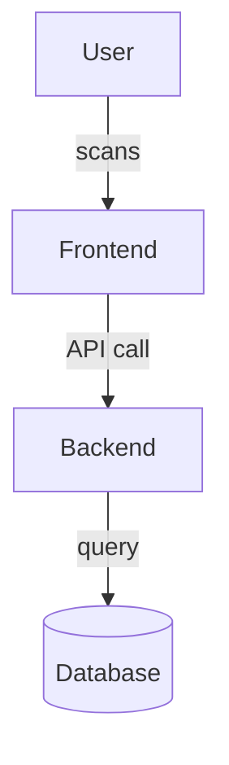
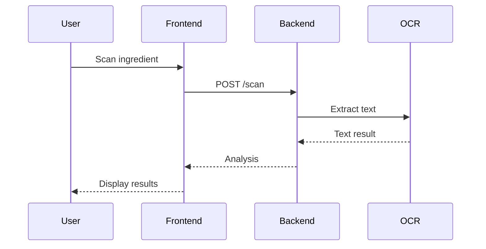
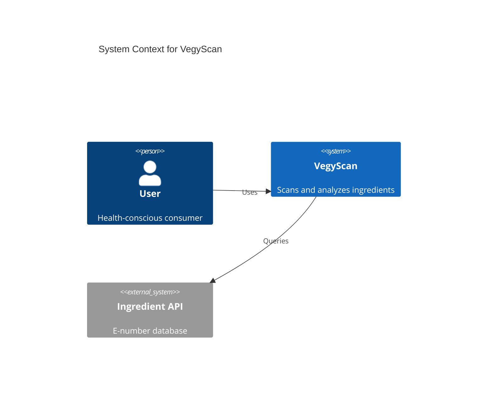
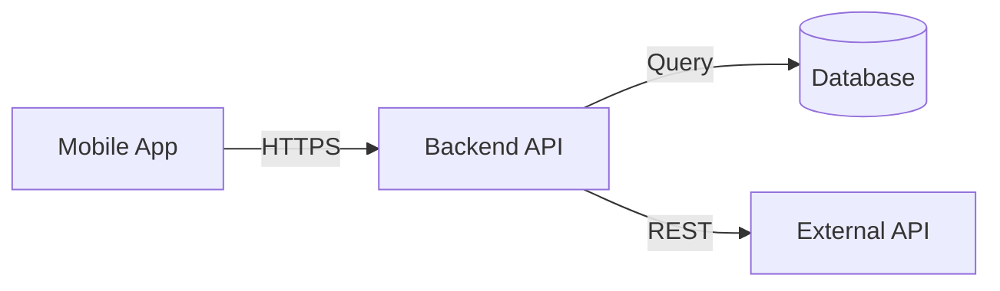
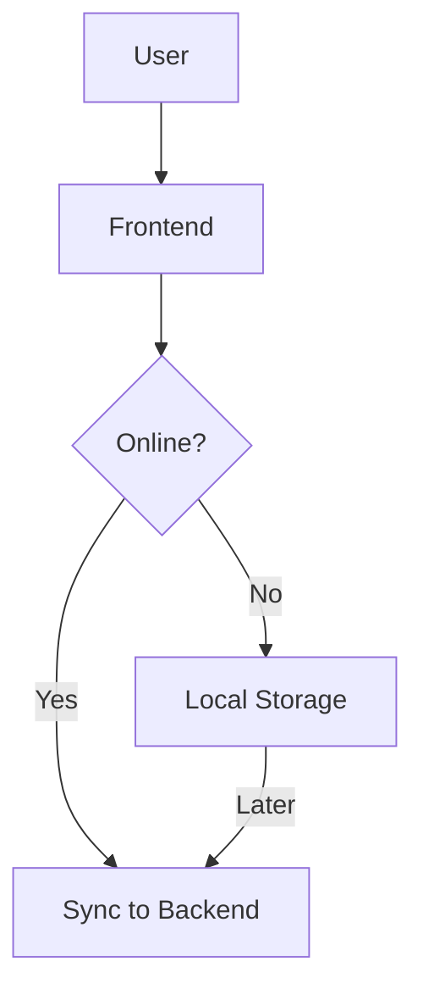
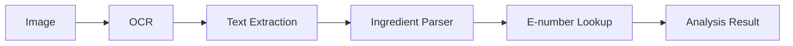

# Diagrams - AI Instructions

## Purpose

Diagrams provide visual representation of system architecture, components, and data flow.

## Diagram Types

### System Context (C4 Level 1)
**File:** `system-context.mmd`

**Shows:**
- ✅ The system as a black box
- ✅ External users/systems interacting with it
- ✅ High-level dependencies

**Use when:**
- Explaining system scope to stakeholders
- Onboarding new team members
- Architecture overview presentations

**Mermaid type:** `graph` or `C4Context`

---

### Component Diagram (C4 Level 3)
**File:** `components.mmd`

**Shows:**
- ✅ Internal structure of the system
- ✅ Major components/modules
- ✅ Component responsibilities
- ✅ Inter-component communication

**Use when:**
- Explaining system internals to developers
- Planning refactoring
- Identifying coupling issues

**Mermaid type:** `graph`, `flowchart`, or `C4Component`

---

### Data Flow Diagram
**File:** `data-flow.mmd`

**Shows:**
- ✅ How data moves through the system
- ✅ Data transformations
- ✅ Storage points
- ✅ Data sources and sinks

**Use when:**
- Debugging data issues
- Optimizing performance
- Understanding data lifecycle

**Mermaid type:** `flowchart` or `sequenceDiagram`

---

## Creating/Updating Diagrams

### File Format
- ✅ Use `.mmd` extension (Mermaid)
- ✅ One diagram per file
- ✅ Include title and date in diagram
- ❌ Don't use proprietary formats (Visio, Draw.io files)
- ❌ Don't commit binary images (PNG/JPG) unless necessary

### Mermaid Syntax

**Flowchart/Graph:**


**Sequence Diagram:**


**C4 Context:**


---

## Update Rules

### When to update
- ✅ New component added to system
- ✅ Component relationships change
- ✅ Data flow changes significantly
- ✅ Major refactoring

### When NOT to update
- ❌ Minor code changes
- ❌ Internal component refactoring (unless structure changes)
- ❌ Styling/UI changes (unless affect architecture)

### Process
1. Identify which diagram(s) need updating
2. Edit the `.mmd` file directly
3. Verify syntax with Mermaid Live Editor if complex
4. Update "Last Updated" date in diagram title/comment
5. Link to related ADR if change is driven by decision

---

## Diagram Metadata

Include at top of each `.mmd` file:

```mermaid
---
title: System Context Diagram
---
%%{init: {'theme':'neutral'}}%%
%% Last Updated: 2025-11-15
%% Related: ADR-0001, ADR-0005
```

---

## Content Rules

### System Context
**Include:**
- ✅ Primary users (link to personas)
- ✅ External systems/APIs
- ✅ Data flows (simplified)

**Exclude:**
- ❌ Internal components (→ components.mmd)
- ❌ Implementation details
- ❌ Database schema

### Component Diagram
**Include:**
- ✅ Major components (Frontend, Backend, Database, etc.)
- ✅ Component responsibilities
- ✅ Communication patterns (REST, GraphQL, events, etc.)

**Exclude:**
- ❌ Individual classes/functions
- ❌ Code-level details
- ❌ External systems (→ system-context.mmd)

### Data Flow
**Include:**
- ✅ Data sources (user input, APIs, sensors)
- ✅ Processing steps
- ✅ Storage locations
- ✅ Data transformations

**Exclude:**
- ❌ Code implementation
- ❌ Exact database queries
- ❌ UI details

---

## Cross-References

Link diagrams to:
- Requirements that drive architecture
- ADRs that explain technology choices
- Overview.md for narrative context

**Example in diagram comment:**
```
%% This diagram reflects decisions in ADR-0003 (microservices)
%% Addresses REQ-NF-007 (scalability)
```

---

## Version Control

Diagrams are code - treat them like code:
- Commit changes with clear messages
- Reference ADRs in commit messages
- Keep diagrams in sync with actual architecture
- Review diagram changes in PRs

---

## Common Diagram Patterns

### Mobile + Backend + API


### Offline-First


### Data Processing Pipeline


---

## Tools

- **Mermaid Live Editor:** https://mermaid.live/ (test syntax)
- **VS Code Extension:** "Mermaid Preview"
- **Documentation:** https://mermaid.js.org/

---

## Checklist for New Diagram

- [ ] File named descriptively (e.g., `components.mmd`)
- [ ] Title and last updated date included
- [ ] Appropriate Mermaid diagram type used
- [ ] Linked to relevant ADRs/requirements in comments
- [ ] Diagram is readable (not too complex)
- [ ] Syntax validated (renders correctly)
