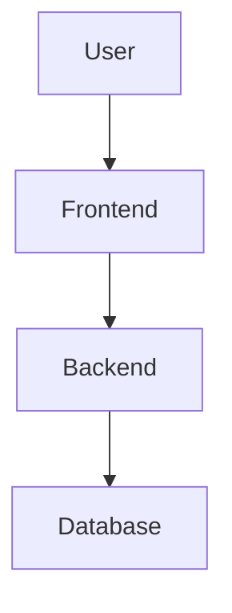

# Architecture Overview

> **Last Updated:** 2025-11-15

_This file is the Single Source of Truth for the current tech stack and high-level architecture._

---

## Tech Stack

### Frontend
- **Framework:** [To be decided - see ADRs]
- **Language:** [To be decided]
- **Key Libraries:** [To be filled]

### Backend
- **Framework:** [To be decided - see ADRs]
- **Language:** [To be decided]
- **Database:** [To be decided - see ADRs]

### Infrastructure
- **Hosting:** [To be decided]
- **CI/CD:** [To be decided]

### Development Tools
- **Version Control:** Git
- **Package Manager:** [To be decided]
- **Testing:** [To be decided]

---

## High-Level Architecture

_[To be filled: Brief description of the system architecture]_

_[This is a placeholder - will be refined based on decisions]_

---

## Key Architecture Patterns

_[To be filled: E.g., MVC, microservices, event-driven, etc.]_

---

## Related Decisions

- [ADR-001: Initial Tech Stack](./adr/0001-initial-tech-stack.md) _(example)_
- [All ADRs](./adr/)

---

## System Diagrams

For detailed diagrams, see [diagrams/](./diagrams/):
- [System Context](./diagrams/system-context.mmd)
- [Component Diagram](./diagrams/components.mmd)
- [Data Flow](./diagrams/data-flow.mmd)
